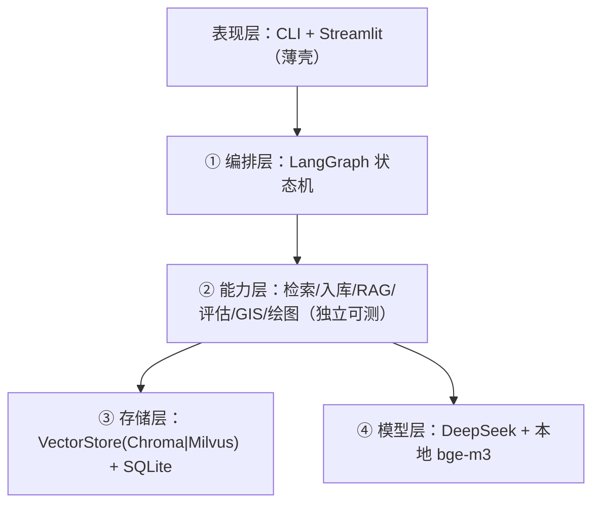

<div align="center">

# 🌍 GeoResearcher

**面向 GIS / 时空大数据 / 智慧城市的科研 Copilot**

*编排式多智能体 · 可评估 RAG 知识库 · GIS 空间分析 · 顶刊风格绘图*


</div>

---

## ✨ 这是什么

GeoResearcher 是一个**人机协同的领域垂直科研助手**，把科研工作流串成一个可控闭环：

```
合法检索入库 →(可评估 RAG 知识库)→ 结构化解读归档 → [找创新点]
   → GIS 空间分析 → 顶刊风格出图 → [中英学术写作]
```

与通用科研 agent（AI-Scientist / GPT-Researcher / STORM / PaperQA2）不同，它专注 **GIS 时空领域**，并把三件别人没做好的事做深：

- 🔬 **可评估、可优化的 RAG 内核** —— 检索层 + 生成层分层评估（Hit Rate / MRR / NDCG / Faithfulness），评估驱动优化闭环。
- 🗺️ **GIS 垂直工具链** —— 通过 MCP 集成 `gis-mcp`（PySAL 空间统计）与 `qgis_mcp`（专题图渲染）。
- 📊 **顶刊风格绘图模板库** —— Nature Cities 风格的 choropleth / 统计图，模板化组合出图。

## 🏗️ 架构（四层解耦）



> 设计要点：**编排层(LangGraph)与检索层(LlamaIndex)解耦**；向量库与 judge model 做接口抽象可切；embedding 本地化。完整架构决策见 [`docs/design`](docs/design--20260704--v1.md) 的 11 条 ADR。

## 🚀 快速开始

```bash
# 1. 安装（Python 3.11+，推荐 uv）
uv venv --python 3.11 && uv pip install -e ".[dev]"

# 2. 配置密钥
cp .env.example .env   # 填入 DEEPSEEK_API_KEY

# 3. 自检骨架
uv run georesearcher doctor
```

## 📚 文档

| 文档 | 内容 |
|---|---|
| [design](docs/design--20260704--v1.md) | 架构、模块、三层记忆、RAG 评估、MCP、11 条 ADR、执行者交接规范 |
| [plan](docs/plan--20260704--v1.md) | M0–M8 分阶段开发计划，每阶段可 demo |

## 🧭 路线图

- [x] **M0** 项目骨架与规范（四层分层、config、存储/模型接口、CLI 自检）
- [ ] **M1** RAG 内核重构（HyDE + 多查询 + rerank，带 APA 引用）
- [ ] **M2** RAG 评估（分层指标 + 优化闭环）⭐
- [ ] **M3** 合法文献检索入库 + 结构化解读
- [ ] **M4** GIS 能力（空间自相关 + choropleth）⭐
- [ ] **M5** 顶刊绘图模板库 ⭐
- [ ] **M6** LangGraph 端到端编排 + Streamlit demo
- [ ] **M7** 展示门面打磨

## 📄 License

MIT
