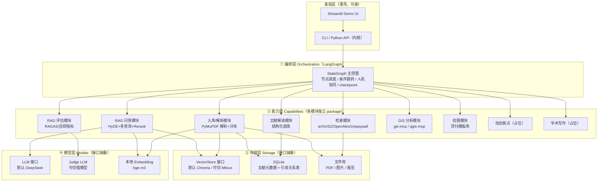
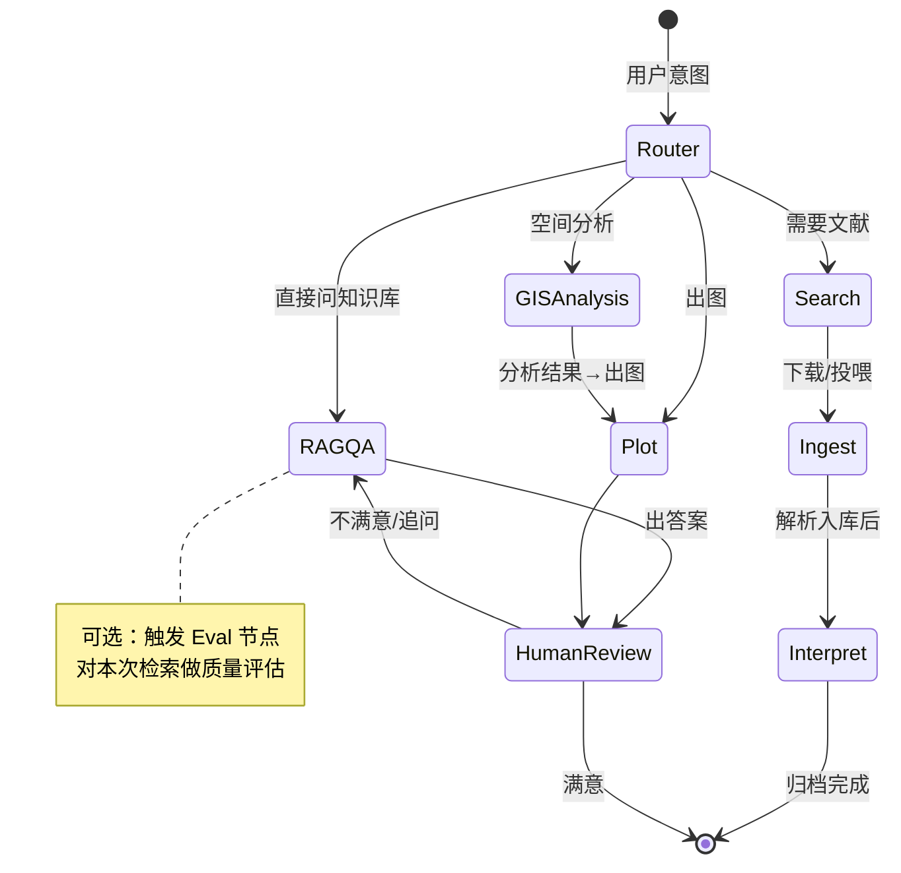

# GeoResearcher 科研 Agent — 方案设计文档（design）

- **文档类型**：design（方案设计）
- **版本**：v1
- **日期**：2026-07-04
- **状态**：架构 grill 已完成（10 条决策），本文为落地方案。

> 本文档配套：`research--20260704--v1.md`（调研，在 docs2/）、`plan--20260704--v1.md`（开发计划）、`interview--20260704--v1.md`（面试应答手册）。

---

## 目录

1. [项目定位与目标](#1-项目定位与目标)
2. [总体架构（四层）](#2-总体架构四层)
3. [LangGraph 编排设计](#3-langgraph-编排设计)
4. [三层记忆 / 知识库设计](#4-三层记忆--知识库设计)
5. [RAG 内核与评估模块](#5-rag-内核与评估模块)
6. [GIS 能力层设计](#6-gis-能力层设计)
7. [顶刊绘图模块设计](#7-顶刊绘图模块设计)
8. [模型层与 MCP 清单](#8-模型层与-mcp-清单)
9. [工程规范（可维护性硬约束）](#9-工程规范可维护性硬约束)
10. [目录结构](#10-目录结构)
11. [架构决策记录 ADR](#11-架构决策记录-adr)

---

## 1. 项目定位与目标

**GeoResearcher**（暂名）：面向 GIS / 时空大数据 / 智慧城市的**科研 Copilot**。人机协同、编排式多智能体，串起科研闭环：

```
合法检索入库 →(可评估 RAG 知识库)→ 结构化解读归档 → [找创新点(占位)]
   → GIS 空间分析 → 顶刊风格出图 → [中英学术写作(占位)]
```

- **首要目标**：简历项目（大模型应用 / Agent 开发岗）。评判标准 = 架构清晰 + 选型有 trade-off + 有可 demo 闭环 + 有工程亮点。
- **三大差异化卖点**：① 可评估/可优化的 RAG 内核；② GIS 垂直工具链（gis-mcp + qgis_mcp）；③ 顶刊风格绘图模板库。
- **做深**：RAG+评估、GIS、绘图。**demo 级**：检索入库、解读归档。**占位**：找创新点、学术写作、跑实验闭环。

---

## 2. 总体架构（四层）

**硬约束：分层清晰，层间只通过接口调用。**



**各层职责：**

| 层 | 职责 | 关键技术 |
|---|---|---|
| **表现层** | 只做输入输出，无业务逻辑 | CLI（Typer/argparse）+ Streamlit |
| **① 编排层** | 定义流程、调度能力节点、状态传递、人机协同、断点 | **LangGraph** |
| **② 能力层** | 每个科研能力 = 独立可测 package | Python 模块 + MCP client |
| **③ 存储层** | 向量 / 结构化 / 文件，接口抽象可切 | **Chroma/Milvus + SQLite** |
| **④ 模型层** | LLM / judge / embedding，接口抽象可切 | **DeepSeek + bge-m3** |

---

## 3. LangGraph 编排设计

**核心思想**：一个共享的 `ResearchState` 在图的节点间流转，节点职责单一，边定义流程与条件分支。**这就是"编排式多智能体"——节点即专职 agent，通过 state 传递而非自由通信。**

### 3.1 共享状态 ResearchState（示意）

```python
class ResearchState(TypedDict):
    query: str                    # 研究主题/问题
    papers: list[Paper]           # 检索到的文献
    ingested_ids: list[str]       # 已入库文献 id
    notes: list[StructuredNote]   # 结构化解读笔记
    rag_answer: str               # RAG 问答结果
    eval_report: EvalReport | None# RAG 评估结果（可选触发）
    gis_result: GISResult | None  # 空间分析结果
    figures: list[FigurePath]     # 生成的图
    draft: str | None             # 写作草稿（占位）
    messages: list                # 对话/工具消息
    human_feedback: str | None    # 人机协同插入点
```

### 3.2 主控图（节点 = 专职 agent）



- **Router 节点**：判断用户意图，路由到对应子流程（意图识别用 LLM）。
- **人机协同（HumanReview）**：LangGraph 的 interrupt / checkpoint，在关键节点暂停等你确认——落实"co-pilot 而非全自动"。
- **条件边**：如"检索结果 < N 篇 → 换关键词重搜"、"RAG 评估分低 → 提示优化"。
- **可扩展**：IDEA / WRITE 节点先占位（直接返回"未实现"或调外部 skill），预留接口。

---

## 4. 三层记忆 / 知识库设计

| 层 | 内容 | 存储 | 生命周期 |
|---|---|---|---|
| **短期记忆** | 当前任务态、对话上下文、工具中间结果 | LangGraph state + checkpoint | 单任务/会话 |
| **长期记忆（向量）** | 文献分块的向量 + 元数据 → RAG 检索 | **VectorStore（Chroma/Milvus）** | 持久 |
| **结构化记忆** | 文献元数据、结构化笔记、引用关系 | **SQLite** | 持久 |

### 4.1 SQLite 结构（含知识图谱升级钩子）

```sql
-- 文献主表
papers(id, title, authors, year, venue, doi, arxiv_id, pdf_path, oa_status, retracted, added_at)
-- 结构化笔记（逐篇解读）
notes(paper_id, research_question, method, contribution, gap, key_findings, summary)
-- 引用关系表 = 未来导 Neo4j 的钩子
citations(src_paper_id, dst_paper_id, context)
```

> **知识图谱升级路径**：现在 `citations` 表就是图的边；将来需要时，一段脚本即可导出 `(Paper)-[:CITES]->(Paper)`、`(Paper)-[:USES]->(Method)` 到 Neo4j。**架构预留，暂不实现。**

---

## 5. RAG 内核与评估模块

> 这是"研问"重构升级的核心，也是简历/面试的重头戏。

### 5.1 检索流程（已实现 M1：HyDE + 多查询 + 混合检索 + 交叉编码器重排序）

```
Query
 → Tag 预过滤（SQLite 关键词匹配，最多 3 个标签）
 → HyDE（LLM 生成假设性文档） + 多查询扩展（LLM 生成 3 个变体，并行）
 → 稠密检索（bge-m3, Chroma, top 40 per query）
   + 稀疏检索（BM25, rank_bm25 内存索引 25k 文档, top 40 per query）
 → RRF 融合（Reciprocal Rank Fusion, k=60）
 → 交叉编码器重排序（bge-reranker-v2-m3, top 20 → top 5）
   fallback: LLM judge 重排序（DeepSeek pointwise 打分）
 → [TTLCache 缓存（600s, 64 entries）]
 → 父块上下文扩展（section 全文从 SQLite parent_chunks 加载）
 → LLM 生成（强制引用 grounding, APA 格式）
```
### 5.1.1 混合检索架构（M1 已实现）

**稠密检索（Dense）**：
- Embedding: `BAAI/bge-m3` 本地 SentenceTransformer，normalize embeddings
- 向量库: Chroma（PersistentClient, HNSW 索引）
- 配置: `config.yaml` → `retrieval.hybrid_candidates`（默认 40）

**稀疏检索（BM25）**：
- 实现: `rank_bm25.BM25Okapi` 内存索引
- 分词: 中英混合（空格分割 + 中文单字拆分）
- 构建: 懒加载，首次 `retrieve()` 时从 Chroma `col.get()` 拉取全部文档
- 配置: `config.yaml` → `retrieval.use_bm25`（默认 true）

**RRF 融合**：
- 公式: `score(chunk) = sum(1 / (k + rank_i))` for each retriever i
- 参数: `k = 60`（标准值），`config.yaml` → `retrieval.rrf_k`

**交叉编码器重排序**：
- 模型: `BAAI/bge-reranker-v2-m3`（CrossEncoder），懒加载
- 输入: query + passage 对
- 配置: `config.yaml` → `retrieval.use_cross_encoder`（默认 true），`rerank_candidates`（默认 20）
- Fallback: LLM judge（DeepSeek pointwise 打分），`config.yaml` → `retrieval.use_reranker`

**上下文组装**：
- 父块扩展: 子块命中后通过 `paper_id + section_idx` 查 SQLite `parent_chunks` 表，加载 section 全文
- 生成时优先使用父块（完整上下文），每段截断 1500 字符

### 5.2 评估模块（面试痛点，独立可测 package）

**分层评估：**

| 层 | 指标 | 工具 |
|---|---|---|
| 检索层 | Hit Rate / Recall@k、MRR、NDCG、Context Precision/Recall | LlamaIndex RetrieverEvaluator + 自研 |
| 生成层 | Faithfulness、Answer Relevancy、Answer Correctness | **RAGAS** + LLM-as-judge |

**评估→定位→优化 闭环：**

```
建评估集（LLM 半自动造 QA + 人工校验，几十~百条）
 → 跑分层指标
 → 检索层低 → 调 分块/embedding/混合检索/rerank/HyDE/多查询
 → 生成层低 → 调 prompt/强制引用/缩上下文/降温
 → 回归：每次改动跑同一评估集，防跷跷板
 → 线上：采样监控 groundedness
```

**LLM-as-judge 三个坑（必须掌握）：**
1. **自我偏好偏差** → judge 用不同模型 / 人工抽检
2. **位置 & 长度偏差** → 随机化顺序、控制长度
3. **评分不一致** → 降 temperature、多次取平均、用是/否细粒度问题替代 1-5 打分

judge model 做成**可配置**：默认 DeepSeek（省钱），验证期切强模型交叉对照。

---

## 6. GIS 能力层设计

**接两个现成 MCP，不重复造轮子：**

| 能力 | 接入 | 用途 |
|---|---|---|
| 库级空间分析（无需 QGIS） | **gis-mcp**（MIT）| Shapely/GeoPandas/PyProj/Rasterio/**PySAL 空间统计**（Moran's I、空间自相关、空间回归）——智慧城市/社科刚需 |
| QGIS 桌面操作 | **qgis_mcp** | 加载图层、跑 Processing 算法、**渲染 choropleth 专题图**、导出 PNG |

- 能力层封装一个 `gis` package，内部通过 MCP client 调用，对上层暴露干净的 Python 接口（如 `spatial_autocorrelation(gdf, field)`、`render_choropleth(...)`）。
- ⚠️ 安全：qgis_mcp 的 `execute_code` 能跑任意 PyQGIS，能力层要做输入约束 / 白名单，不直接把 LLM 输出无过滤执行。

---

## 7. 顶刊绘图模块设计

**生态空白，本项目原创点。**

```
figures/
├── templates/          # 顶刊风格模板（Nature Cities 风）
│   ├── style_nature.mplstyle    # 配色/字体/字号/线宽
│   ├── choropleth.py            # 分级专题地图（含比例尺/指北针/图例）
│   ├── bar_grouped.py           # 分组柱状
│   ├── scatter_fit.py           # 散点+拟合
│   └── multi_panel.py           # 多子图排版(a)(b)(c)
├── palette.py          # 顶刊配色方案（离散/连续/发散）
└── compose.py          # "选模板→填数据→组合出图"入口
```

- 技术：matplotlib（`.mplstyle`）+ geopandas + plotnine（可选）。
- 设计原则：**模板化 + 参数化 + 可组合**。用户/agent 只需"选模板 + 传数据 + 指定字段"，输出即顶刊级图。
- 与 GIS 模块联动：空间分析结果（GeoDataFrame）直接喂给 `choropleth.py`。

---

## 8. 模型层与 MCP 清单

### 8.1 模型层（接口抽象，可切）

| 用途 | 默认 | 可切 |
|---|---|---|
| 主 LLM（编排/问答/解读） | **DeepSeek** | OpenAI 兼容任意 |
| Judge LLM（评估） | DeepSeek | GPT-4o / Claude（验证期） |
| Embedding | **本地 bge-m3** | bge-small（快速档） |
| Reranker | **bge-reranker-v2-m3**（交叉编码器） | — |

### 8.2 MCP 清单

| MCP | 来源 | 用途 | 许可 |
|---|---|---|---|
| gis-mcp | mahdin75 | 库级 GIS/空间统计 | MIT |
| qgis_mcp | jjsantos01 | QGIS 桌面操作/专题图 | 见仓库 |
| （可选）文献检索 MCP | 自建/社区 | 封装 arXiv/S2/OpenAlex | — |

> GPT-Researcher/LangGraph 生态已验证 MCP 集成模式，本项目沿用"能力层通过 MCP client 调外部工具"的做法。

---

## 9. 工程规范（可维护性硬约束）

1. **分层不可越界**：表现层不碰存储；能力层不直接 new 具体向量库，只依赖 `VectorStore` 接口；模型调用统一走模型层接口。
2. **每个能力 = 独立 package**，有明确 `input/output` dataclass，**必须有单元测试**。
3. **配置集中**：`config.yaml`（模型、向量库后端、路径、开关）——切 Chroma↔Milvus、切 judge model 只改配置。
4. **AI 协作规矩**（写进 codebuddy.md）：AI 改代码必须遵守分层、改动附带/更新测试、不破坏接口。
5. **可复现**：`requirements.txt` / `pyproject.toml` 锁版本；README 写清"clone→install→run"三步。
6. 原则：**stability > explainability > reusability > scalability > novelty**。

---

## 10. 目录结构

```
research_agent/
├── README.md               # 花里胡哨的展示门面（架构图/徽章/gif/ADR摘要）
├── codebuddy.md            # 项目记忆（入 git）
├── config.yaml             # 集中配置
├── pyproject.toml
├── docs/                   # plan / design / interview（入 git）
├── docs2/                  # research / SESSION-STATE（不入 git）
├── src/georesearcher/
│   ├── orchestration/      # ① LangGraph 图、节点、state
│   ├── capabilities/       # ② 能力层
│   │   ├── search/         #   文献检索（arXiv/S2/OpenAlex/Unpaywall）
│   │   ├── ingest/         #   PDF 解析+分块入库
│   │   ├── rag/            #   HyDE+多查询+rerank 问答
│   │   ├── evaluation/     #   RAG 评估（做深）
│   │   ├── interpret/      #   文献结构化解读
│   │   ├── gis/            #   gis-mcp / qgis-mcp 封装（做深）
│   │   ├── plotting/       #   顶刊绘图模板（做深）
│   │   ├── ideation/       #   找创新点（占位）
│   │   └── writing/        #   学术写作（占位）
│   ├── storage/            # ③ VectorStore 接口 + Chroma/Milvus + SQLite
│   ├── models/             # ④ LLM/judge/embedding 接口
│   └── ui/                 # CLI + Streamlit
└── tests/                  # 各能力单测 + 评估集
```

---

## 11. 架构决策记录（ADR）

> 每条 = 决策 + 备选 + 理由 + trade-off。README 放摘要，面试话术见 interview 文档。

**ADR-01 编排式 vs 真 multi-agent** → 选**编排式（LangGraph）**。备选：自主 multi-agent。理由：面试更看重"为什么这样拆/如何控成本与失控/如何调试"；DeepSeek 上自主 agent 群易失控烧钱；业务是有序流程，天然适合图。Trade-off：牺牲"自由协作"的灵活性换取可控/可测。

**ADR-02 LangGraph vs LlamaIndex Workflows** → 选 **LangGraph 管编排 + LlamaIndex 管 RAG**。理由：各用其所长，编排层/检索层解耦；LangGraph 面试认知度与生态最好。Trade-off：多一个依赖与概念。

**ADR-03 向量库双模式** → **默认 Chroma，可切 Milvus，抽象 VectorStore**。理由：demo 可跑性 + 保留 Milvus 生产资产 + 展示"面向接口设计"。Trade-off：多写适配层。

**ADR-04 结构化存储 SQLite** → 选 **SQLite**（~200 篇够用），预留 Neo4j 钩子。理由：零运维、可跑性；MySQL 旧项目已体现；Neo4j 会破坏可跑性且关系抽取不稳。Trade-off：放弃现成图查询能力，用引用表折中。

**ADR-05 本地 Embedding bge-m3** → 不做抽象。理由：延续"消除外部依赖"的加分点、免费离线、中英+混合检索；此处抽象是过度设计。Trade-off：首次需下模型。

**ADR-06 Judge LLM 可配置** → 默认 DeepSeek，可切强模型。理由：省钱 + 能回答"裁判可信度"追问。Trade-off：需处理 LLM-as-judge 偏差（见 §5.2）。

**ADR-07 可维护性=硬约束** → 四层分层 + 模块独立可测。理由：靠 AI 写代码必须有清晰边界防"意大利面"；对简历是工程能力证明。Trade-off：前期搭骨架慢。

**ADR-08 交付 CLI+Streamlit** → 内核与 UI 解耦。理由：Streamlit 快、AI 好写、demo 冲击力；Vue3 留旧项目。Trade-off：界面偏工具感。

**ADR-09 文献来源合法路径** → arXiv/S2/OpenAlex/Unpaywall + 本地投喂，禁 Sci-Hub。理由：合规是面试加分、GitHub 可公开、无法律风险。Trade-off：付费墙论文需手动投喂 PDF。

**ADR-10 范围控制** → 做深 3 个（RAG评估/GIS/绘图），其余 demo 或占位。理由：简历项目最忌贪全；窄闭环做透 > 宽而浅。Trade-off：功能不"全"，但故事完整可讲。

**ADR-11 混合检索架构** → 稠密（bge-m3 + Chroma）+ 稀疏（BM25 rank_bm25 内存索引）+ RRF 融合（k=60）+ 交叉编码器重排序（bge-reranker-v2-m3）。备选：纯稠密或 LLM-only rerank。理由：BM25 补足稠密对精确关键词匹配的弱点；RRF 免调权重；交叉编码器比 LLM judge 更快、更一致、零 API 费用。Trade-off：BM25 索引需额外内存（~100MB for 25k docs），交叉编码器需额外模型下载（~2GB）。

---

## 12. 给执行者的交接规范（弱模型必读）⚠️

> 本章为"把开发交给能力较弱的模型/新手"而写。**执行前必须完整读本章 + codebuddy.md。遇到本章未覆盖的决策，停下来问，不要自行发挥。**

### 12.1 环境与版本（不要装错）

- **Python 版本：3.11**（PaperQA2 思路、LangGraph、部分依赖要求 3.11+；gis-mcp 要 3.10+，3.11 兼容）。
- 用 `uv` 或 `venv` 建虚拟环境，不要污染系统 Python。
- **依赖版本以 `pyproject.toml` 为唯一真相**。若 `pyproject.toml` 尚未创建，按下表安装并**在 pyproject 里锁定实际装到的版本号**（不要凭记忆写版本号，装完用 `pip freeze` 回填）：

| 包 | 用途 | 备注 |
|---|---|---|
| langgraph | 编排 | 用最新稳定版；API 变动大，务必对照官方文档，勿凭记忆写 |
| llama-index-core | RAG 内核 | 及相关 reader/embeddings 子包 |
| chromadb | 默认向量库 | |
| sentence-transformers | 加载 bge-m3 | |
| pymupdf | PDF 解析 | import 名为 `fitz` |
| ragas | RAG 评估 | |
| openai | 调 DeepSeek（OpenAI 兼容） | |
| typer | CLI | |
| streamlit | demo UI | |
| pydantic | dataclass/校验 | v2 |
| mcp | MCP client | 调 gis-mcp/qgis_mcp |

> **禁止**：不要擅自新增未在此表/pyproject 中的重依赖（如 Neo4j、Milvus 客户端在 M0-M7 阶段不装，Milvus 只留接口桩）。需要新依赖先问。

### 12.2 DeepSeek 接入（唯一正确方式）

DeepSeek 用 **OpenAI 兼容接口**，不要找"deepseek 专用 SDK"：

```python
# models/llm.py 里应长这样（key 从环境变量读，绝不硬编码）
from openai import OpenAI
client = OpenAI(
    api_key=os.environ["DEEPSEEK_API_KEY"],
    base_url="https://api.deepseek.com",   # 官方兼容端点
)
# 模型名：对话用 "deepseek-chat"；推理用 "deepseek-reasoner"
```

- **API key 一律从环境变量/`.env` 读，禁止写进代码或提交 git**（`.env` 已在 .gitignore）。
- judge model 走同一个 LLM 接口，只是 `config.yaml` 里可以配不同 `base_url`/`model`。

### 12.3 关键接口签名（照抄，不要自创字段）

**VectorStore 接口**（storage 层，能力层只依赖它）：
```python
from typing import Protocol
class VectorStore(Protocol):
    def add(self, chunks: list["Chunk"]) -> list[str]: ...          # 返回 chunk id
    def search(self, query_emb: list[float], top_k: int,
               filters: dict | None = None) -> list["Retrieved"]: ...
    def delete_by_doc(self, doc_id: str) -> None: ...
```
- M0 只实现 `ChromaVectorStore`；`MilvusVectorStore` 建同名类但方法体 `raise NotImplementedError`（留桩）。

**核心数据结构**（用 pydantic BaseModel，字段名固定）：
```python
class Paper(BaseModel):
    id: str; title: str; authors: list[str]; year: int | None
    venue: str | None; doi: str | None; arxiv_id: str | None
    pdf_path: str | None; oa_status: str | None; retracted: bool = False

class Chunk(BaseModel):
    id: str; paper_id: str; text: str; level: str  # 三级粒度: "doc"/"section"/"para"
    embedding: list[float] | None = None

class StructuredNote(BaseModel):
    paper_id: str; research_question: str; method: str
    contribution: str; gap: str; key_findings: str; summary: str

class Retrieved(BaseModel):
    chunk: Chunk; score: float
```
> 这些字段要和 SQLite schema（design §4.1）**保持一致**。改字段要同时改 schema + 迁移，别只改一处。

### 12.4 MCP 如何在 Python 里调用

- gis-mcp / qgis_mcp 是独立进程，用 `mcp` 库的 client 通过 stdio 连接。
- 能力层的 `gis/` 包封装：启动/连接 MCP → 调用工具 → 解析返回 → 暴露干净 Python 函数。
- **M0-M3 不碰 MCP**，到 M4 再接。M4 开始前先确认 gis-mcp 能独立跑通（`pip install gis-mcp` 后按其 README 起服务）。
- ⚠️ qgis_mcp 的 `execute_code`：能力层**不得**把 LLM 原始输出直接执行，必须走参数化封装或白名单。

### 12.5 完成定义（DoD）——每个任务做到这样才算"完成"

一个任务/模块视为完成，必须**同时**满足：
1. 代码遵守四层分层（design §2），未跨层直接依赖具体实现；
2. 有对应的 pytest 单元测试，且 `pytest` 全绿；
3. 能被 CLI 或一个 `examples/` 里的最小脚本跑通（不是"代码存在"就算完成）；
4. 涉及的接口/字段与本文档一致，不一致则更新文档并说明；
5. 不引入未批准的新依赖、不修改已定架构决策（ADR）。

### 12.6 禁止事项（红线）

- ❌ 不改 10 条 ADR 的决策（design §11）；有异议先提出，不擅自改。
- ❌ 不硬编码密钥；不提交 `.env`、`docs2/`、大模型权重、数据文件到 git。
- ❌ 不集成 Sci-Hub 或任何盗版文献源（ADR-09）。
- ❌ 不为"看起来高级"引入 Milvus/Neo4j/微服务（M0-M7 用 Chroma+SQLite）。
- ❌ 不跳过测试、不用 `--no-verify` 绕过检查。
- ❌ 报告"完成"前必须按 §12.5 DoD 实测，不允许只凭"代码写了"就说完成。

### 12.7 卡住时怎么办

1. 先查 codebuddy.md + 本 design + plan 是否已有答案；
2. 官方文档为准（尤其 LangGraph/LlamaIndex API，勿凭记忆）；
3. 仍不确定 → **停下来向人类提问**，说明卡在哪、你的两三个候选方案及各自 trade-off，不要猜着往下写。

---

## 13. 我是如何用 AI 开发这个项目的（工程方法论）

> 这既是给执行者看的协作方式说明，也是面试高频题的答案素材（详见 interview 文档对应章节）。

本项目**几乎全部代码由 AI 生成**，但不是"甩给 AI 一句话"，而是一套有纪律的协作方法：

1. **先调研、再设计、后编码**：用 AI 做竞品/技术调研（research 文档）→ 通过"被 AI 反问（grill）"逐条敲定 10 个架构决策 → 形成 design/plan/ADR → 才开始写代码。**决策权在我，AI 负责放大我的判断，而非替我决策。**
2. **文档驱动开发（doc-driven）**：所有约束写进 `codebuddy.md`（项目记忆）+ design + plan，AI 每次基于文档工作，保证跨会话一致、不跑偏。
3. **可维护性作为硬约束**：四层分层、模块独立可测、配置集中——因为 AI 无全局记忆，清晰边界是让 AI"局部改不破坏全局"的前提。
4. **小步 + 可验证**：按里程碑推进，每步有 DoD 和测试，用"验证结果而非相信输出"的方式确认 AI 真的做对了。
5. **人负责审查与取舍**：AI 给方案和 trade-off，我做最终选择（如砍掉实验闭环、克制不上 Neo4j）。

---

*下一步：见 plan--20260704--v1.md（分阶段开发计划）与 interview--20260704--v1.md（面试应答手册）。*
